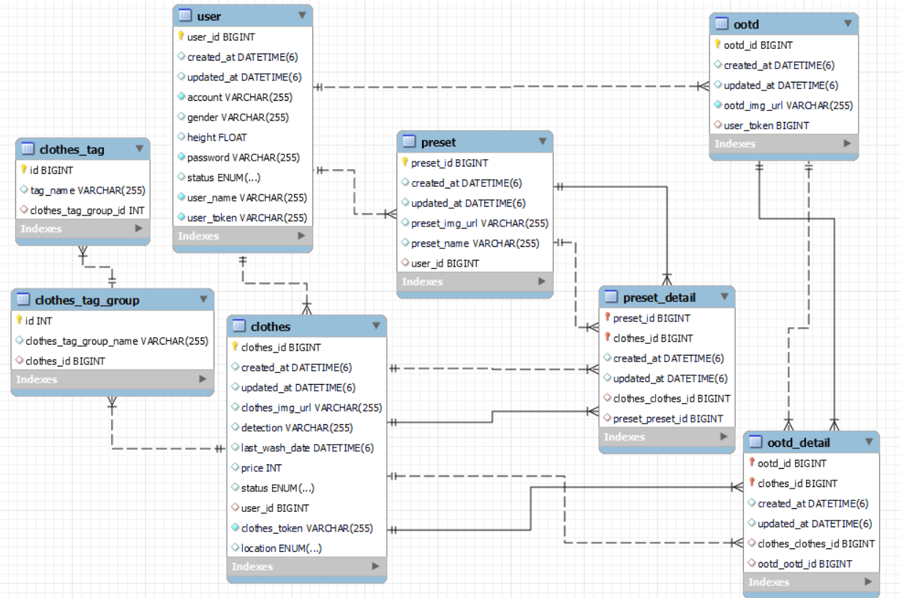
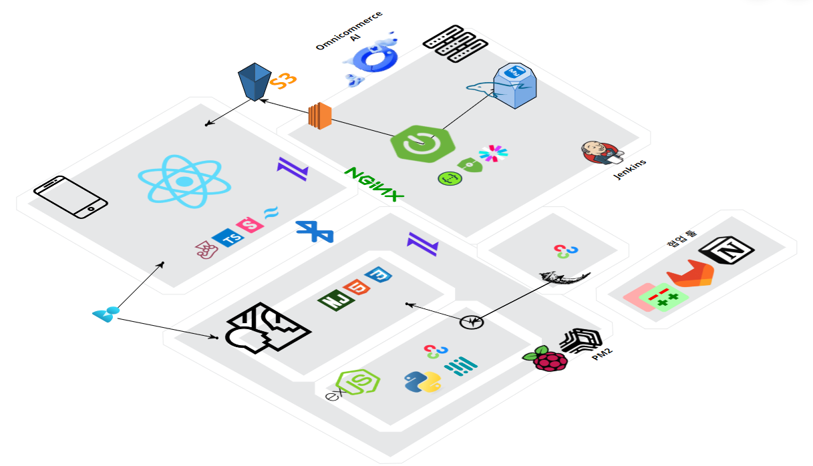

# Close At Hand 🙌

✔ 본 프로젝트는 삼성 청년 SW 아카데미 2학기 특화 프로젝트 결과물입니다.

## 개요🌱

- 어떤 옷을 입어야 할지 모르겠어요! 아침이 너무 바빠요!
- 옷 관리에 어려움을 느끼는 사람들의 도우미
- 스마트 거울을 활용한 옷/스타일 관리 서비스
- 당신의 가까이에 Close At Hand

## UCC🎞

## 팀 무지개반사🌈

## 프로젝트 기간💞️

### 진행기간📆

- 2024년 2월 26일 ~ 2023년 4월 5일(6주)👋

## 개발 환경 👀

### 기술 스택📚

- JavaScript es6++
- JAVA 17
- Node.js `20.11.0`
- TypeScript `5.4.2`
- react Native `0.73.6`
- react `18.2.0`
- zustand `4.5.2`
- realem `12.6.2`
- expo `50.0.14`
- Android Studio `2023.1.1 Patch 2`
- SpringBoot `3.2.2`
- JPA
- MySQL `8.0`
- JWT `0.12.3`
- Amazon EC2
- Jenkins
- Docker

### 협업 툴➰

- Notion
- Mattermost
- gitlab
- jira
- gerrit
- google docs
- Figma

## ERD

## 아키텍쳐

## 어플리케이션

### **1. 로그인 페이지(회원가입 페이지)**

✔️ 아이디, 비밀번호를 입력 후 회원가입

✔️ 중복체크를 통한 ID 검사

✔️ JWT를 이용하여 거울과 앱에서 사용자 확인

### **2. 메인페이지**

✔️ 거울과 상호작용 기능(거울 인터페이스 조정, 와이파이 정보 입력, )

✔️ 오늘의 추천 옷 확인

✔️ 옷장의 옷 개수 확인, 세탁물 옷 확인

### **3. 내 옷장**

사진

✔️ 옷장에 등록된 모든 옷 확인 가능

✔️ 각 옷의 상세 정보제공

✔️ 태그 검색 가능

### **4. 내 코디**

사진

✔️ 원하는 옷을 골라 코디 설정 가능

✔️ 각 코디의 이름 설정 및 옷 추가 삭제 기능

✔️ 코디에 사진을 넣어 해당 옷을 입은 모습을 넣을 수 있다.

### **5. 빨래 바구니**

✔️ 오늘 입은 옷 중 선택을 통해 빨래바구니로 이동 가능

✔️ 옷의 재질에 따라 빨래 종류를 구분(울, 면 등)

### **6. 옷 기록**

✔️ 옷 상세정보 제공

✔️ 입었던 옷들의 기록 확인

### **7. 설정**

✔️ 블루투스 연결

✔️ 알림기능

✔️ 프로필 설정

## 스마트 미러

### 0. 메인 화면

메인화면 사진 유저 인식 전 / 유저 인식 후

✔️ 얼굴 인식을 통한 유저 인식

✔️ 현재 날씨 및 예보 정보 제공

✔️ 실시간 뉴스 제공

✔️ 시간/날씨/이벤트에 따른 상호작용 메세지

### 1. AR 옷 입어보기

✔️ AR 코디 페이지에서 당일 추천된 옷 조회

✔️ 포멀/세미캐주얼/캐주얼 세 분류로 옷 추천

✔️ 위 아래 스와이프를 통해 분류 간 이동

✔️ 손을 폈다가 쥐는 모션을 통해 오늘의 AR 선택

### 2. 옷 등록하기

✔️ 외출 전 스마트미러 기기 앞에서 오늘의 OOTD 촬영

✔️ 손을 폈다가 쥐는 모션을 통해 촬영 시작

✔️ 촬영 한 OOTD는 앱 메인페이지의 ‘오늘의 OOTD’ 위젯에 실시간 반영

### 3. Swipe 페이지 전환

✔️ Swipe 제스처를 통한 페이지 전환 기능

# 역할 분담

## BE

| 김연빈                                                       | 최진우                                                       |
| ------------------------------------------------------------ | ------------------------------------------------------------ |
| 인프라                                                       | BE 팀장                                                      |
| EC2 환경에서 Jenkins, Docker를 활용하여 백엔드 자동빌드 환경 구축,프론트엔드 산출물 APK 다운로드 받을 수 있는 랜딩페이지 생성 | Rest Api 백엔드 구성, 외부 AI 서비스를 이용 등록된 옷 상세 정보 저장, jwt 와 security를 활용한 인증, 인가 구현 |

## EM

| 서지수                                                       | 한성주                                                       |
| ------------------------------------------------------------ | ------------------------------------------------------------ |
| 부팀장                                                       | EM 팀장                                                      |
| Motion 인식을 통한 기능(제스처 페이지네이션, 사진 찍기 등), 초음파 센서를 통한 사용자 인식, 클로젯핸드 디바이스 인터페이스 | AR Fitting 기능(모션 인식, 가상 옷 피팅), 얼굴인식 로그인, 옷 / ootd 등록, REST API 연결 |

## FE

| 배영환                                                       | 최도훈                                                       |
| ------------------------------------------------------------ | ------------------------------------------------------------ |
| 👑 팀장                                                       | FE 팀장                                                      |
| 옷장페이지 구현(등록 및 수정, 옷 목록, 검색) 코디페이지 구현(프리셋 등록 및 수정, 코디 목록) | 홈화면, 홈 위젯, 블루투스, 설정 페이지, 회원관리, 빨래 바구니(로컬 데이터베이스 관리), 기타 공통 컴포넌트 및 네비게이션, APK 빌드 |
