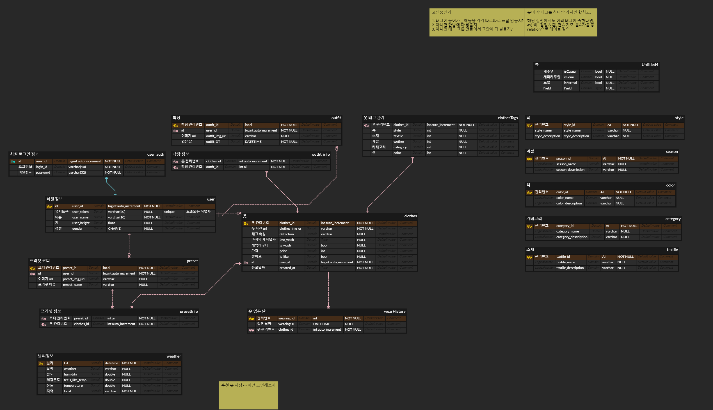
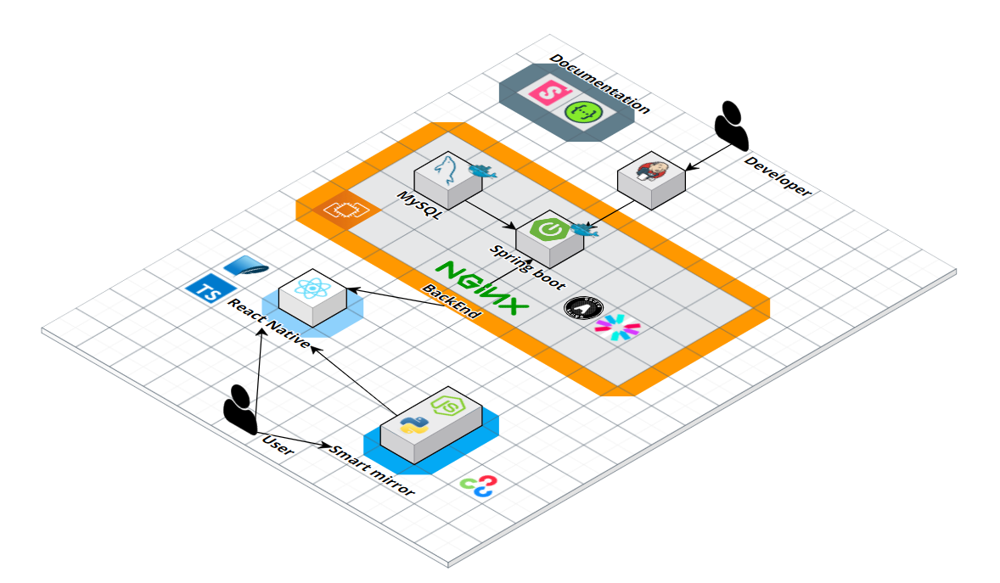
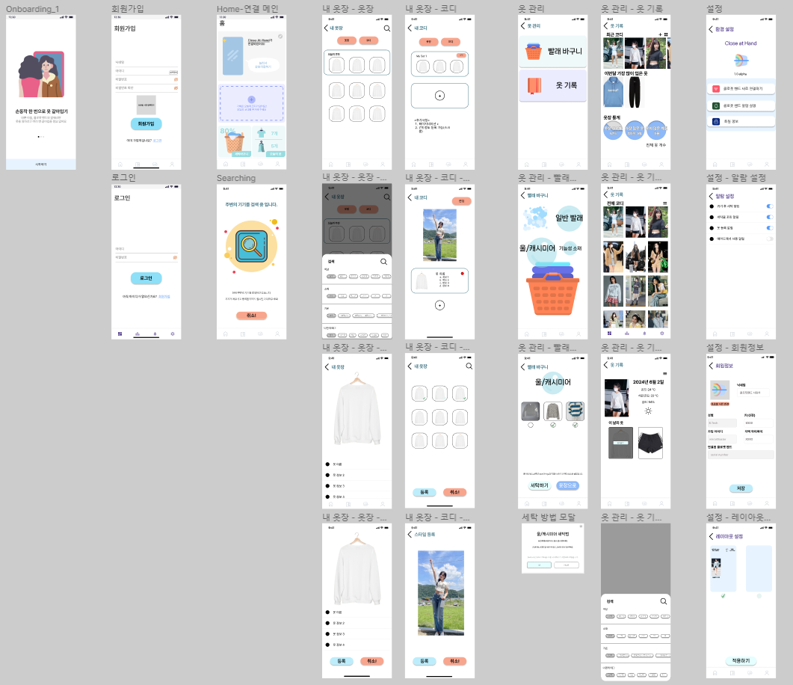
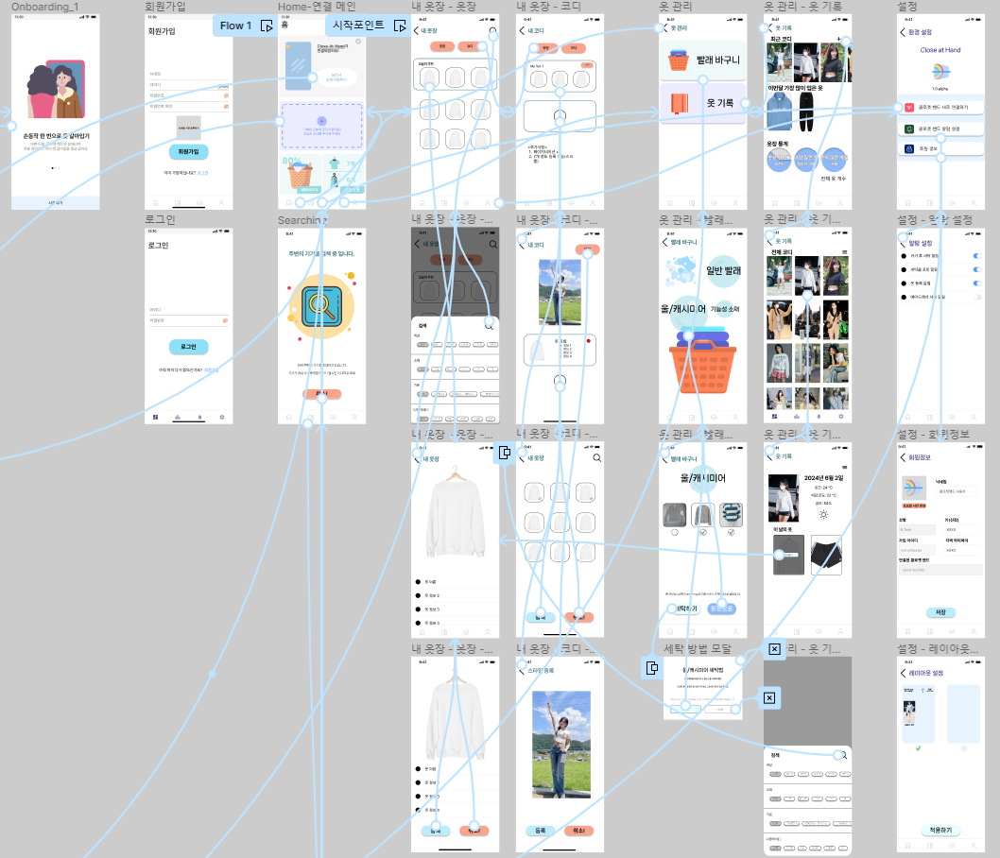

# Close At Hand 🏦

💰 본 프로젝트는 삼성 청년 SW 아카데미 2학기 특화 프로젝트 결과물입니다.

## 개요🌱

- 현대인 한명이 하루에 접하는 정보량은 20세기 초 사람들이 평생 접한 정보량에 버금갈 정도
- 수많은 정보는 선택의 다양성을 넓혔다
- 하루에도 수 천 가지의 선택을 해야하는 우리를 위한 웹 어플리케이션
- 내 곁의 코디네이터 Close At Hand

## UCC

## 팀 무지개반사

| **최도훈 [FE]**                              | **한성주 [EM]**                                      | **최진우 [BE]**                             |
| --------------------------------------- | --------------------------------------------- | ------------------------------------- |
|    |  |            |
| CSS   발표   팀장 | 투표 기능 개발   Notion 정리   멘탈 지킴이 | 프론트 총괄   WebRTC 기능 구현   일정 관리, 페이스메이커 |
| **배영환(팀장) [FE]**                              | **서지수 [EM]**                                  | **김연빈 [BE]**                          |
|            |                |   |
|  API 설계 및 관리, API 키 관리   모델링 및 내부 DB 설계   UCC 편집, 분위기 메이커 | 아키텍쳐 및 API 설계   FE 기능 구현 지원   특급 운전수 | 기술고문, 기획 및 API 설계   AWS 및 CI/CD 구성   의사소통 활성화 |

## 프로젝트 기간💞️

### 진행기간

- 2024년 2월 26일 ~ 2023년 4월 5일(6주)👋

  

## 개발 환경 👀

    <h1>📚 STACKS</h1>

  

    
    
    
        
       
           
        
        
        
    
    
      
           
        
        
       
       
        
        
    
    
           
       
    
      

#### 기술스택 {수정 필요}

- JavaScript es6++

- JAVA 17

- Node.js 20.11.0

- vite 5.0.8

- react 18.2.0

- zustand

- tailwindcss 3.4.1

- SpringBoot 3.2.2

- redis

- JPA

- MySQL

- openVIdu

- OAUTH

- Amazon EC2

- Jenkins

- Docker

#### 협업 툴👊

- Notion
- Mattermost
- gitlab
- jira
- gerrit
- google docs
- Figma

## ERD 🌐

## 아키텍쳐♟️

## 앱 🕸️

### 0. 구조

### 1. 로그인 페이지(회원가입 페이지)

​	✔️ 아이디, 비밀번호를 입력 후 회원가입

​	✔️ 중복체크를 통한 ID 검사

​	✔️ JWT를 이용하여 거울과 앱에서 사용자 확인

### 2. 메인페이지

​	✔️ 거울과 상호작용 기능(거울 인터페이스 조정, 와이파이 정보 입력, )

​	✔️ 오늘의 추천 옷 확인

​	✔️ 옷장의 옷 개수 확인, 세탁물 옷 확인

### 3. 내 옷장

​	✔️ 옷장에 등록된 모든 옷 확인 가능

​	✔️ 각 옷의 상세 정보제공

​	✔️ 태그 검색 가능

### 4. 내 코디

​	✔️ 원하는 옷을 골라 코디 설정 가능

​	✔️ 각 코디의 이름 설정 및 옷 추가 삭제 기능

​	✔️ 코디에 사진을 넣어 해당 옷을 입은 모습을 넣을 수 있다.

### 5. 빨래 바구니

​	✔️ 오늘 입은 옷 중 선택을 통해 빨래바구니로 이동 가능

​	✔️ 옷의 재질에 따라 빨래 종류를 구분(울, 면 등)

### 6. 옷 관리

​	✔️ 

​	✔️ 2~4개의 사진 혹은 텍스트를 투표로 올릴 수 있음

​	✔️ 실시간 채팅 및 투표를 지원

### 7. 소비성향알려쥬

​	✔️ 간단한 질문을 통한 소비성향 분석

​	✔️ 다양한 소비성향에 대한 재미난 분석

### 8. 마이페이지

​	✔️ 개인 정보 및 투표 관련 참여 데이터 제공

​	✔️ 작성, 참여, 좋아요, 댓글 단 투표 데이터 제공

## 거울

### 